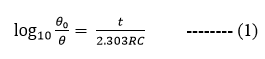
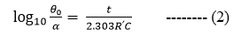
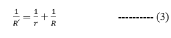

If a charged condenser of capacity C (having self leakage resistance ‘r’) is discharged through any high resistance R then
  

the graph between log10⁡〖θ0/θ〗  and t will be straight line.  

where θ0 = the deflection corresponding to the first throw of the galvanometer 
          θ = the deflection of the galvanometer when the capacitor is discharged through resistor R. 
The relation (1) can also be written as  
 
Where α = the deflection of the galvanometer when the capacitor is discharged through resistor R՛
and R՛ is the resistance of the equivalent parallel resistance of the galvanometer and self leakage resistance r of the condenser. 

