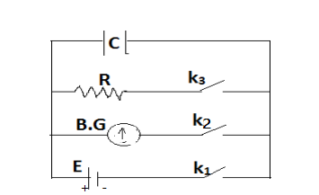
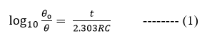
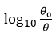
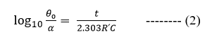
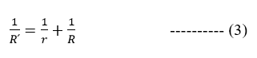

Consider the circuit shown in the figure a condenser C, resistance R, Ballastic Galvanomenter B.G. and cell of emf E is connected in as shown in the circuit. Keeping K2 and K3 open, the capacitor is charged by depressing the key K1. K1 is then opened and at once K3 is closed. The capacitor discharges through the galvanometer, &theta;0 is proportional to Q0. The capacitor is again charged, the throw  which records a throw to the maximum value keeping K2 and K3 open and K1 closed. K1 is then opened and K2 is closed for a known time t. Some of the charge leaks through R. K2 is opened and at once K3 is closed. The charge Q remaining on the capacitor is noted by noting the value of &theta; (deflection produced in the Ballastic Galvanometer).  
 
If a charged condenser of capacity C (having self leakage resistance ‘r’) is discharged through any high resistance R in time‘t’ then 
 
the graph between  and t will be straight line.  
where &theta;0 = the deflection corresponding to the first throw of the galvanometer
          &theta; = the deflection of the galvanometer when the capacitor is discharged through resistor R.
The relation (1) can also be written as  
 
Where &alpha; = the deflection of the galvanometer when the capacitor is discharged through resistor R' 
and R՛ is the resistance of the equivalent parallel resistance of the galvanometer and self leakage resistance r of the condenser. 

