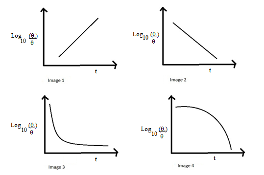
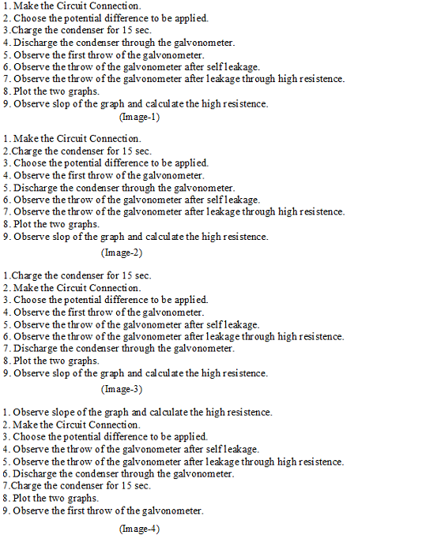

## Pedagogy (Round 1)

 
<b> Experiment To Measure high resistance by leakage method    

<b>Discipline | <b>Pysicsal Sciences
:--|:--|
<b> Lab | <b> Basics of Physics
<b> Experiment|     <b> 1. To Measure high resistance by leakage method

<h4> [1. Focus Area](#LO)
<h4> [2. Learning Objectives ](#LO)
<h4> [3. Instructional Strategy](#IS)
<h4> [4. Task & Assessment Questions](#AQ)
<h4> [5. Simulator Interactions](#SI)

#### 1. Focus Area : Reinforce theoretical concept

#### 2. Learning Objectives and Cognitive Level

Sr. No |	Learning Objective	| Cognitive Level | Action Verb
:--|:--|:--|:-:
1.| Identify the relation between Resistance, capacitance and deflection of galvanometer in discharging RC circuit.   | Recall | Identify
2.| Describe the methodology to observe the deflection in galvanometer connected with discharging RC circuit.  | Understand  |  Describe
3.|  Predict the leakage resistance, resistance R՛ by plotting a graph between log10⁡〖θ0/θ〗 and t also between log10⁡〖θ0/α〗  and t.
 | Apply |  Predict
4.| Examine the slope of plotted graph and calculate the value of r and R՛ | Analyze |  Examine
5.|  Conclude the high resistance R connected to the circuit. | Evaluate  |  Conclude

 

    <b><a href="#top">↥ back to top</a></b>

 

#### 3. Instructional Strategy
###### Name of Instructional Strategy  :     Expository
###### Assessment Method: summative

<u> <b>Description: </b> of how you are going to implement the above Instructional Strategy in your Simulator: </u>
 
 Brief description as per handout

 

    <b><a href="#top">↥ back to top</a></b>

 

#### 4. Task & Assessment Questions:

Read the theory and comprehend the concepts related to the experiment. [LO1, LO2, LO3]
 

Sr. No |	Learning Objective	| Task to be performed by   the student  in the simulator | Assessment Questions as per LO & Task
:--|:--|:--|:-:
1.| Student will identify the relation between Resistance, capacitance and deflection of galvanometer in discharging RC circuit.   | Student will complete introduction. He will be given 4 images for graph between and t will choose correct image from them.| Choose the correct image for the graph between〖 log10⁡〖θ0/θ〗 and t. a)Image 1 b)Image 2 c)Image 3 d)Image4 
2.| To enable the student to describe the methodology to observe the deflection in galvanometer connected with discharging RC circuit.  |  Student will be given 4 images for the correctprocedure to be followed in the experiment. He will choose correct image from them. | Choose the correct image for the graph between〖 log10⁡〖θ0/θ〗 and t. a)Image 1 b)Image 2 c)Image 3 d)Image4 
3.|  Student will be able to Predict the leakage resistance, resistance R՛ by plotting a graph between log10⁡〖θ0/θ〗  and t also between log10⁡〖θ0/α〗  and t. | Student experimental setup taking observations for current in the deflections in galvanometer for calculation of r and R՛.  | The capacity of the condenser connected to the circuit is of the order of:  a) µF b) pF c) ηF d) NOT 
4.| Student will the slope of plotted graph and calculate the value of r and R՛ | Student will take observations for deflections in galvanometer plot graph between   log10⁡〖θ0/θ〗 and t. | Slope of the graph between log10⁡〖θ0/θ〗  and t is: a) always positive b) always negative c) positive then negative d) negative then positive 
5.| Conclude the high resistance R connected to the circuit. |  Students will calculate slope of the plotted graph between and also between log10⁡〖θ0/θ〗 and t calculate the slope of these graphs to calculate the unknown resistance | The order of the unknown resistance is:  a) Mῼ   b) ῼ    c)  µῼ  d) Kῼ    

 

    <b><a href="#top">↥ back to top</a></b>

 

#### 4. Simulator Interactions:
 

Sr.No | What Students will do? |	What Simulator will do?	| Purpose of the task
:--|:--|:--|:--:
1.| Activity description   next line   next line | Click on the ‘Activity description   next line  '  | Describe the purpose in detail.
2.| Activity description   next line   next line | Click on the ‘Activity description   next line  '  | Describe the purpose in detail.
3.| Activity description   next line   next line | Click on the ‘Activity description   next line  '  | Describe the purpose in detail.
4.| Activity description   next line   next line | Click on the ‘Activity description   next line  '  | Describe the purpose in detail.
